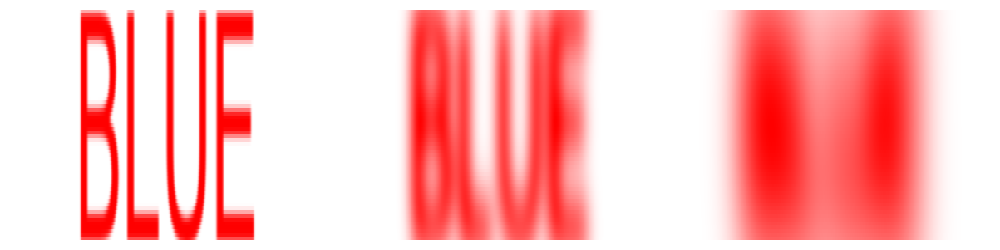

```{r globals}
library(papaja)
library(BayesFactor)
library(gamlss.dist)
library(mvtnorm)
#library(spatialfil) 
library(png)
library(ggplot2)
library(lemon)
library(tibble)
library(cowplot)
library(dplyr)
library(readr)
library(beeswarm)
```


Experimental psychologists *love* ANOVA.  We love to use it and to teach it.  We love multiway interactions.  We love the compact reporting style of results.  We even love the quirky calculus of partitioning the sum of squares and counting degrees of freedom.  

Even though most experimental psychologists love ANOVA, they would have a hard time specifying the statistical models that underlie it.  The love we feel for ANOVA comes from our familiarity with ANOVA as a procedure, and these procedures include the computation of $F$-statistics, degrees of freedom, and $p$-values.  Statistical models, including those underlying ANOVA procedures, are the formal device used for inference.  A model links substantive statements to data [@Rouder.etal.2016a]. To perform inference, one makes principled statements about the appropriateness of certain models or certain parameter values conditional on data. 

ANOVA in the common usage refers both to a set of procedures to partition variances from experimental treatments and a set of linear mixed models that specifies how treatments and participants combine to provide probability distributions over data.  Can the procedures of ANOVA be profitably used without consideration of linear mixed models [@Wilk.Kempthorne.1956]?  @Gigerenzer.1998 strikes us as especially relevant here.  He distinguishes between statistical thinking and using statistics as ritual.  When ANOVA is used as a procedure that produces $p$-values as outputs, Gigerenzer claims that the user may do so without any statistical thinking at all.  Building on Gigerenzer, the reliance on the procedural view of ANOVA does not inform us whether the implied underlying models are appropriate for the experimental design at hand [@Wilk.Kempthorne.1956].  In this special issue, we see that what is the appropriate model for experiments, especially for those with within-subject designs, is indeed a contentious issue.  We are grateful for @vanDoorn.etal.2021 for laying out the model-specification issues clearly.  Here we address the issues in the context of ANOVA.

The main thesis of this paper is that the conventional models underlying ANOVA procedures are deficient from a *substantive* perspective.  These models assert situations that are implausible and untenable inasmuch as they rely on mere coincidences that cannot hold generally.  The key here is that the arguments about untenability are based in the substance of psychology as a science rather than based in the mathematics or statistics.  In this regard, we appeal to your sensibilities as a psychological scientist rather than a methodologist.  The claim developed herein is that when ANOVA is implemented with  *substantively* reasonable models, many of the conventional ANOVA procedures seem ill-advised and many of the conventional ANOVA intuitions seem unwise.  Perhaps the consequences are most clear in mixed models, but they hold across ANOVA defined generally.

## ANOVA Yesterday and Today

Before going on, a bit of history is helpful.  ANOVA was invented in the 1920s by Ronald Fisher who worked at a British agricultural research station [e.g., @Fisher.1925].  The genius of ANOVA was the partition of the sum-of-squares into interpretable, orthogonal units.  And this partition could be made as a data-analytic *procedure* without much thought about the underlying statistical models, much as principle components analysis (PCA) is used today.  One of the slickest innovations with ANOVA is the treatment of within-subject (repeated measures) designs.  In the procedural view, accounting for random-subject effects is straightforward.  All one needs to do is adjust the denominator of the $F$-test---use mean-square interaction terms rather than mean-square residual error terms.  Yet, what exactly are random-subject effects?  In classical statistics, there are two types of objects: data and parameters.  Data are observed and governed by probability distributions that may depend on parameters.  Parameters are not observed and are not distributed.  They are fixed unknowns.  Random effects are neither parameters nor data---they are distributed yet not observed.

The procedural view of ANOVA stands in contrast to two alternative orientations in the field.  The first is the *latent variable* tradition, and we include in this tradition mixed models, hierarchical models, and structural equation models [@Baayen.etal.2002;@Barr.etal.2013;@Bollen.1989].   Latent variables are similar to data in that they are governed by distributions, but unlike data, they are not observed.  Random effects are then modeled as latent variables.  The second tradition is the Bayesian tradition.  In the Bayesian tradition, both parameters and data are governed by distributions.  The only difference between the two is that data are observed where parameters are not.  There is no need for a third object in the Bayesian tradition [@Efron.Morris.1977].  For our purposes here, we focus on the commonality of these two traditions, that the specification of statistical models guides analysis.  This emphasis on specification stands in contrast to procedural ANOVA.

```{r}
source('betweenFunctions.R')
```

# The Models of ANOVA

In this section, we provide the models that underlie ANOVA; in the next section we provide a critique of them on substantive grounds.  Consider for now a simple $2\times 2$ between-subject design with factors of A and B.  The most general model for this case is given as:
\begin{equation} \label{full1}
Y_{ijk} = \mu+\alpha_i+\beta_j+\gamma_{ij} +\epsilon_{ijk},
\end{equation}
where $i$ indexes the level of Factor A, $j$ indexes the level of Factor $B$, and $k$ indexes replicates.  The noise terms, $\epsilon_{ijk}$, are mutually independent, zero-centered normal deviates with a variance of $\sigma^2$.  When there are two levels of each factor, there is a single grand mean parameter, $\mu$, two main-effect parameters for Factor A, $\alpha_i$, two main-effect parameters for Factor B, $\beta_j$, and four interaction parameters $\gamma_{ij}$.  The total number of parameters that determine the cell means are 9, which is problematic as there are only 4 cell means in a $2\times 2$ design.  This problem is well known, and consequently, parameters are constrained in one of two ways, which are known as *fixed effects* or *random effects*.  For fixed effects, the constraint is to specify that the sum of certain parameters must be zero.  In the $2\times 2$ case, the specification is that $\alpha_1+\alpha_2=0$, $\beta_1+\beta_2=0$, $\gamma_{11}+\gamma_{12}=0$, $\gamma_{21}+\gamma_{22}=0$, and $\gamma_{11}+\gamma_{21}=0$.  With these sums-to-zero constraints, there are four free parameters: $\mu$, $\alpha_1$, $\beta_1$, and $\gamma_{11}$, which perfectly matches the number of free cell means, again, 4.  The random effects constraint is a bit more complex, and we cover it subsequently.  

Figure \ref{fig:modAOV3} shows the four models conventionally used in ANOVA.  The notation here is a modified form of Wilkinson notation [@Wilkinson.Rogers.1973], which is a popular means of specifying models in software.  The model at the top, specified by `Y~A+B+A:B` is the full model of Eq. (\ref{full1}) in Wilkinson notation.  The convention is that the grand-mean is present, as are the zero-centered noise terms and the sums-to-zero constraints.  The three terms respectively correspond to the main effects of Factors A and B and their interaction.  Shown also are three submodels formed by specifying further constraints.  Take the model directly underneath the full model, `Y~A+B`.  This is the model with a main effect of Factor A, a main effect of Factor B, and no interaction.  This model is formed by setting interaction terms $\gamma_{ij}=0$.  Likewise, models without Factor A are formed by setting $\alpha_i=0$ and models without Factor B are formed by setting $\beta_j=0$.   

```{r modAOV3,fig.cap="Model comparisons in conventional ANOVA."}
drawAOV4()
```


Conventional ANOVA testing is a top-down affair [@Hays.1994].  There are three lines in Figure \ref{fig:modAOV3} with  $F$s on them.  These indicate the models being compared with the respective $F$ test.  Consider $F_A$ (far right in the figure).  If $\alpha_i=0$ (implying `Y~B+A:B`), then the expected value of $F_A=1$ and the distribution of $F_A$ is the usual $F$-distribution with the appropriate degrees of freedom.  If $\alpha_i \neq 0$, then the expected value of $F_A>1$ and unexpectedly large F statistics may be observed, depending on the size of $\alpha_i$ and the sample sizes.  In this sense, $F_A$ is the comparison of a null model `Y~B+A:B` against the alternative `Y~A+B+A:B`, that is, a test of the main effect of Factor A.  

How do the three ANOVA tests map into models?  There are no explicit relations in some sense, but it is our observation that the logic in Table \ref{tab:test2mod} is followed.  The values of each test are considered positive (significant) or negative (insignificant).  These are combined in the straightforward way.  For example, if all three tests are negative, as indicated in the top row, then none of the effects are indicated.  In this case, the data are not dependent on Factor A, Factor B, or their interaction, and the model $Y_{ijk} = \mu +\epsilon_{ijk}$ is indicated.  The shorthand for this model, `Y~.`, is entered into the first row.  Likewise, if just the main effect of Factor A is positive, then only Factor A is entered into the model.  As shown, there are 8 possible combinations of the 3 tests, and each corresponds to a particular model.  


```{r test2mod,results="asis"}
A=c("-","+","-","-","+","+","-","+")
B=c("-","-","+","-","+","-","+","+")
AB=c("-","-","-","+","-","+","+","+")
p=round(c(.95^3,.95^2*.05,.95^2*.05,.95^2*.05,.95*.05^2,.95*.05^2,.95*.05^2,.05^3),4)
mod=rep(c("Y~.","Y~A","Y~B","Y~A:B","Y~A+B","Y~A+A:B","Y~B+A:B","Y~A+B+A:B"))
apa_table(cbind(A,B,AB,mod),col.names=c("$F_A$","$F_B$","$F_{AB}$","Conclusion"),align='lllc',caption="Logic of drawing conclusions from F-tests.")
```

<!--
The logic in Table \ref{tab:test2mod} has a few noteworthy properties.  First, note that there is a built-in penalty for complexity.  More tests need to be positive to conclude with a more complex model.  The last column in the table shows the probability of drawing any model-equivalent conclusion with testing under the null.(footnote about type I error rate)  Here we see higher probabilities for models with fewer terms.  This property is desirable.   Second, we note that the usual practice does not preserve family-wise Type I error rates.  It is a matter of convention to *not* correct for multiple $F$-tests [@Keppel:1991].  Third, and most importantly, main effects and interactions are treated equivalently.  The probability of including a main effect or an interaction depend on the true value of the respective parameters to the same degree. Interactions are treated as a third main effect.  --> 

# Avoiding Coincidences


```{r coincident,fig.cap="Lack of main effects results from a coincidence.  A-B. The perfect cross-over pattern results from picking exactly perfect levels of fat and sugar content.   C-D. Even if one level is changed, then main effects appear. ",fig.asp=1.3}
drawIceCream()
```

One key to good inference is to have models that faithfully translate theoretical constraints into formal or statistical constraints.  When a model does this well, we will say it is *well specified*.  To the degree a model does not capture the theoretical constraints, we will say it is *poorly specified.*   This well-specified vs. poorly-specified distinction is a substantive concern because it centers theoretical constraints.  The question then is whether the three models in Figure \ref{fig:modAOV3} are well specified? 

There is a tradition in statistics in which a certain class of ANOVA models are considered poorly specified.  This class is comprised of models that exclude main effects but include their interactions  [@Langsrud.2003;@Nelder.1994;@Venables.2000;@Yates.1935].  In Figure \ref{fig:modAOV3}, these poorly specified models are `Y~A+A:B` and `Y~B+A:B`.  In each of these, there is an interaction between Factor A and Factor B, but one of the constituent main effects is missing.  

To see why many statisticians find `Y~A+A:B` and `Y~B+A:B` poorly specified, consider the example in Figure \ref{fig:coincident} which is from @Rouder.etal.2016.  Here, a food scientist is assessing how much money consumers might pay for a quart of ice cream as a function of the fat and sugar content.  The data in Panel A show a perfect crossover.   Such a pattern corresponds to a positive result on an interaction and a negative result on main effects.  But is the lack of main effects a coincidence rather than a general state of the environment?

Figure \ref{fig:coincident}B shows how price truly varies as function of sugar and fat.  We see here that the perfect crossover results from picking exactly-balanced values in the $2\times 2$ factorial design.  Panels C and D show the effect of picking a different value for the high-sugar-concentration level.  Now, main effects are observable as well.

We think the above example is typical.  It seems implausible in most research that researchers can pick such exactly balanced levels in their design.  Assuredly, from time to time, researchers will observe data that exhibit a near perfect crossover.  And while the data may seemingly lack main effects, in most cases these main effects must be there lest there be exact perfectly balanced levels.  The observed lack of main effects in most cases then is a coincidental property rather than a deep structural invariance.

How shall we take into account this coincidental property?  The solution is to include main effects whenever interactions are included  [@Langsrud.2003;@Nelder.1994;@Venables.2000].  Figure \ref{fig:modAOV} shows the eight possible models from Table \ref{tab:test2mod}.  Of these eight, three are poorly specified and five are well specified [@Langsrud.2003].

```{r modAOV,fig.cap="The eight models applicable to a 2-way design.  There are five well specified models (light shadeing) and three poorly specified models (dark shading).  Inadmissable models have interactions without corresponding main effects."}
drawAOV8()
```

The exclusion of poorly-specified models in Figure \ref{fig:modAOV} changes ANOVA.  Because the usual $F$-statistics are contrasts where one model may be poorly specified, these $F$-tests are no longer appropriate.  One approach is to devise new $F$-tests that do not allow for main effects without interactions.  The new $F$-test consists of different formulas that are know as Type II sum-of-squares  [@Yates.1935].   @Langsrud.2003 provides a particularly accessible discussion of the models and how they motivate the Type II sum-of-squares formulations.  Nonetheless, it is difficult to find Type II sums-of-squares implemented in software.    

We think that analysts who wish to exclude poorly-specified models will find *model comparison* relatively straightforward and convenient.  With model comparison, one may use conventional comparison techniques and simply exclude the poorly-specified models.  The well-specified models in Figure \ref{fig:modAOV} may be compared by popular methods including Akaike Information Criterion [AIC, @Akaike.1974], Bayesian Information Criterion [BIC, @Schwarz.1978], Bayes factors [@Jeffreys.1961], and leave-one-out cross validation [@Vehtari.etal.2017].

```{r include=FALSE}
dat=makeSmallEffect()
#summary(aov(y~a*b,data=dat))
```

How does excluding poorly-specified models change inference?  Without poorly specified models, larger effects are needed to state evidence for interactions.  Because interactions imply main effects, models containing interactions are necessarily more complex than those with just main effects.  Figure \ref{fig:assessInterF} and Table \ref{tab:assessInterT} tell the story.  The figure provides an example of data that have been engineered to have conventional $F$ statistics for main effects at $F(1,19)=1.0$ and for the interaction at $F(1,19)=4.02$.^[Data come from a 2-by-2 between-subject design with 20 replicates per cell.  The sample means were set to 656.4, 721.8, 721.8, and 700 for the low-low, low-high, high-low, and high-high conditions, respectively.  MSE was 9454, and for this MSE, $F$-statistics were approximately 1.0, 1.0, and 4.0 for the main effects of A and B, and the interactions between them, respectively.] Note that the sample main effects are not exactly zero, but are typical of null effects; the interaction is significant at the $p<.05$ level.  And so by conventional $F$-tests with poorly-specified models, we may consider there to be some evidence of an interaction.

Table \ref{tab:assessInterT} shows the effects of including and excluding poorly-specified models for a few popular model comparison statistics. Let's take AIC.  To help calibrate AIC, a good rule of thumb is that AIC scores should exceed 2.0 to claim that one model is preferred to another.   In this case, if we include the poorly specified model `Y~A:B`, then indeed, this interaction model is preferred over all others, and it is preferred by at least 2 AIC points over models without an interaction term.  The situation changes if we exclude poorly-specified models.  Here, the preferred model is the full model, but it is barely preferred to the null model where there are no effects at all.  Hence, with AIC, excluding poorly-specified models lowers the strength of evidence from the data to claim an interaction.

AIC is known to favor complexity when compared to BIC or Bayes factors.  The BIC values here are equivocal between the null and the poorly-specified model `Y~A:B`.  But when the poorly-specified models are excluded, there is now  evidence against the interaction (or any effect).  The same pattern holds for Bayes factors as well.  And just as with AIC, excluding poorly-specified models lowers the strength of evidence from the data for an interaction. 

The take-home here is that of commonality.  Regardless of model selection technique, the exclusion or inclusion of these poorly-specified models is a weighty issue.  When they are included, the claim of an interaction may be made on smaller effects than when they are excluded.  Given the implausibility of these poorly specified models, claims of interactions with them should be given careful scrutiny. 


```{r assessInterF,fig.cap="Is there an interaction here?  The answer depends on the included models (Table 2)."}
dat=makeSmallEffect()
aic=makeAIC(dat)
bic=makeBIC(dat)
bf=anovaBF(y~a*b,data=dat,progress=FALSE,whichModels = "all")

papaja::apa_beeplot(dat,id="sub",dv="y",factors=c("a","b"),
                    ylim=c(min(dat$y),max(dat$y)),
                    ylab="Response Time (ms)",
                    xlab="Factor A",
                    args_x_axis=list(labels=c("Low","High")),
                    args_legend=list(title="Factor B",legend=c("Low","High")))
```

```{r assessInterT,results="asis"}
o=c(1,2,3,5,8,4,6,7)
bfVal=c(1,extractBF(bf)$bf)
tab=cbind(mod[o],round(aic[o]-min(aic),3),round(bic[o]-min(bic),3),round(bfVal[o],3))
colnames(tab)=c("Model","AIC","BIC","BF")
apa_table(tab,caption="Evidence for models from data in Figure 4.",
          stub_indents=list("Well Specified"=c(1,5),"Poorly Specified"=c(6,8)),
          midrules=c(6),
          align='clll')
```

# Coincidences As Substative Concerns

Should psychologists use models that have interactions but no main effects?  The question is not a statistical one but a substantive one.  It is up to individual substantive researchers to determine when and whether models are well specified.  In the following, we provide two examples, one in which models that have interactions without corresponding main effects should be excluded, and another where perhaps they may be included.   

**Example 1.** Consider a cognitive-aging memory experiment where younger and older adults are recalling nouns and verbs under the hypothesis that verbs may be differentially difficult to recall for older adults because they are abstract and require a binding to an object.  Because the hypothesis is a differential effect, the target behavioral signature is an age-by-part-of-speech interaction.  Assume that there will be an age main effect as it is well established that older adults have mnemonic difficulties [@Salthouse.1996].  The question is whether we are willing to interpret an age-by-part-of-speech interaction in the absence of a true part-of-speech main effect.  Such an interaction without a part-of-speech main effect implies that the advantage for nouns over verbs for older adults is perfectly balanced by an equally sized advantage for verbs over nouns in younger adults.  We think that this balance should it be indicated by conventional ANOVA is a spurious coincidence.  In this case, as a matter of a substantive importance, we would evidence interactions against null models that explicitly allow for such main effects and, accordingly, pay the price in complexity as in Table \ref{tab:assessInterT}.

**Example 2.** Consider a Simon interference task where red and green boxes are presented as stimuli and the participant must use their left hand to indicate that the box was red and their right hand to indicate that the box was green.  In the Simon task, the boxes are presented to the left and right of fixation, and the main finding is a laterality-based interference where it takes more time when the side of stimulus display and correct response are contralateral than ipsilateral.  Consider side-of-presentation as Factor A (left/right) and the color as Factor B (red/green).  The main result here is an interaction.  The main effects of Factor A and B are whether performance depends on which side the stimulus is presented on and color.  The main question is whether it is plausible that there is no main effect in either variable, at least in comparison to the size of the Simon effect.  Is there a plausible invariance of color?  We think given that boxes of both colors are presented well above threshold, there may be no particular advantage of red or green.  Likewise, is there a plausible invariance for side of presentation?  Given the strong physical symmetry of humans, a null results here too is plausible.  Hence, there may be theoretical reasons in this example to consider interactions without main effects.\footnote{We thank Patric Bach for this example.}

<!-- Finally, it pays to note that the definition of what is the main effect and what is an interaction may be arbitrary.  Consider again the ice-cream example from Figure \ref{fig:coincident}. In this example, we had a model with a main effect of sugar and a main effect of fat.  The effect of congruency between sugar and fat level was represented by the interaction between these two factors.  Alternatively, we might define the effect of congruency as a main effect, either sugar or fat as another main effect, and the remaining would then be represented by the interaction.  Could we justify a model with only a main effect of congruency, without considering the effect of sugar or fat? What about a model with only an interaction between congruency and, say, sugar, without considering the main effects of both?  There is no mathematical argument why certain effects should, or should not, be included. The challenge of justifying a statistical model is a substantive one.  -->


# Avoiding Coincidental Models In Within-Subject Designs

```{r}
source('withinFunctions.R')
```


Within-subject designs are the workhorse of experimental psychology.  It is easy to understand why---there is great power in letting each participant serve as their own control.  Variability from participants may be subtracted out, and the resolution for understanding the structure in data is greatly increased.

Unfortunately, the concern about coincidences is pertinent to within-subjects ANOVA procedures.  Consider a simple Stroop experiment where each participant is shown a number of congruent and incongruent trials.  Psychologists tend to call this a *one-way design* with condition (congruent vs. incongruent) manipulated in a within-subject manner.  In the usual course, there is a single question of interest, namely, is there a Stroop effect. And psychologists would answer this question with a paired $t$-test, or, equivalently, a one-way, within-subjects ANOVA.  Statisticians, however, would consider this a *two-way design* with participants and condition serving as factors.  The statisticians' designation is more helpful for understanding coincidences in within-subject designs.

A full model for this case looks the same as before:
\[
Y_{ijk} = \mu+\alpha_i+\beta_j+\gamma_{ij} +\epsilon_{ijk},
\]
where $\alpha_i$s are for the main effects of condition; $\beta_j$ are the main effects of participants; and $\gamma_{ij}$ are interactions between participants and conditions.   Again, there are more parameters than cells, so constraint is needed. The usual sums-to-zero constraint is well suited for the main effect of conditions, i.e., $\alpha_1=-\alpha_2$.  Yet, because participants are considered as random effects, we may not put a sums-to-zero constraint on $\beta_j$.  Instead, participant effects are considered draws from a common parent distribution:
\[
\beta_j \sim \mbox{Normal}(0,\sigma^2_\beta).
\]
Note that $\beta_j$ may be considered the $j$th participant's overall speed unperturbed by trial noise.  There are a few ways of dealing with interactions, and the most general way is simply to treat them analogously to main effects:
\[
\gamma_{ij} \sim \mbox{Normal}(0,\sigma^2_\gamma).
\]
Indeed, this model on random interactions is the one implemented in SAS PROC MIXED.

Bayesian and frequentist models in this case are fairly similar.  Perhaps the main difference is in the treatment of these random-variable parameters, called *latent variables* or *random effects*.  For frequentists, these parameters do not stand on their own---they are nuisance variables that must be integrated out.  For Bayesians, they do stand on their own---they are treated identically to other parameters in the model.  In practice, these theoretical differences matter less than one might think.

Figure \ref{fig:modAOVs} shows the eight models.  In this case, the critical substantive question is whether there is a Stroop effect.  The critical parameters are $\alpha_i$, and the question is whether these are zero.  The usual $F$-test is the contrast between `Y~A+S+A:S` and `Y~S+A:S`.  The question at hand is whether the null for this contrast, `Y~S+A:S`, is well specified.

```{r modAOVs,fig.cap="Eight possible models in a one-way, within-subject setup.  The darkest shade indicates models without a main effect of participants.  We assume participant effect and these models are considered no further.  The middle shade indicates a model inadmissable because there is an interaction without a corresponding main effects.  The line labeled *F*  indicates the conventional contrast, the line labeled *1* and *2* are our previous recommendation and our current recommendation, respectively.  The two models we would consider are connected by Line 2."}
drawWithinMods8()
```

In general, it is not.  The explanation of why so is a bit long, but the payoff is large.  For in the end, we argue that almost all within-subject ANOVAs are poorly specified.  To see why conventional within-subject ANOVA relies on coincidences, let's consider each individual's effect.  Each individual's observed effect is the difference in sample means: $d_j=\bar{Y}_{2j}-\bar{Y}_{1j}$.  The paired $t$-test takes these as inputs to assess whether the population mean is zero. We can also define a true individual effect, $\theta_j$, that is the limit for each person as the number of trials grows without bound.  Indeed, this true individual effect is a substantively important construct---it is what we hope to measure free of trial-by-trial noise [@Rouder.Haaf.2019].

How do these true individual effects map onto substantive psychological processes?  If $\theta_j$ is positive, then the participant has the usual true Stroop effect where congruent items are responded to more quickly than incongruent ones.   If $\theta_j$ is zero, then the participant has no true Stroop effect.  And if $\theta_j$ is negative, then the participant has a Stroop pathology where responses to incongruent items are truly faster than those to congruent ones.  

We think it is of substantive importance whether $\theta_j$ is positive, zero, or negative, and moreover, the sign of $\theta_j$ implies different substantive psychological mechanisms [@Haaf.Rouder.2019] as follows: Positive effects implicate the usual cast of theories including that reading is automatic and generates response competition [@Kahneman.1973].  A zero effect implies a lack of automaticity, and a negative effect, which is hard to envision, would implicate some strategic or compensatory processes.  

Although $\theta_j$ plays an outsized theoretical role, it is not a primary parameter in the ANOVA model.  Instead, it is obtained by adding and subtracting parameters: $\theta_j=(\alpha_2-\alpha_1)+(\gamma_{2j}-\gamma_{1j})$.  Placing the random-effect distributional constraint on the interaction terms $\gamma_{2j}$ and $\gamma_{1j}$ reveals that 
$\theta_j \sim \mbox{Normal}(\alpha_2-\alpha_1,2\sigma^2_\gamma)$.  Figure \ref{fig:anovaTheta} shows the distribution of $\theta_j$ under the full model `Y~A+S+A:S`.  Here, there is an average Stroop effect of 60 ms, and this mean is $\alpha_2-\alpha_1$, the condition main effect (denoted `A`).  The variability is the condition-by-participant interaction, `A:S`, and the standard deviation is $\sqrt{2}\sigma_\gamma$.  The distribution of $\theta_j$ under the null model `Y~S+A:S` is shown as well.  Here, it is centered at 0 with the same variability as under the full model.

```{r anovaTheta,fig.cap="The distribution of individual true effects under the full model (solid line, Model `Y~A+S+A:S`) and under the null model (dashed line, Model `Y~A+A:S`).  The mean of the distribution is the main effect of condition, and the variability is the interaction with individuals."}
drawTheta()
```

To gain insight into the substantive meaning of the null model `Y~S+A:S`, let's use stimuli in our Stroop experiment that are blurred words.  The blurred words are still colored, and the participants' task is still to name the color. An example is shown in Figure \ref{fig:blur}, and participants should report the color *red.*  When the word is clear, in this case the word "BLUE," the word identity may interfere with reporting the color.  However, as the words are blurred, word identity may no longer interfere with color naming.  In the limit that the word is unreadable, we expect no individual to show any Stroop effect whatsoever as fully blurred congruent items (the word RED displayed in RED) are indistinguishable from fully blurred incongruent items (the word BLUE displayed in RED). 

```{r blur,fig.cap="Three hypothetical stimuli in a Stroop task: a clear version, a somewhat blurred version, and a fully blurred version.  The fully blurred version is an appropriate physical model of the null that there is no effect of word identity."}

```

```{r blurMods,fig.cap="Three models on true individual effects.  A: Everybody has a true Stroop effect in the usual direction (faster responses to congruent than incongruent items), and this effect decreases with blur.  The null model is that nobody has any true Stroop effect.  B: Most people have the usual Stroop effect, but some have a true Stroop reversal (faster responses to congruent than incongruent items).  For all people, the Stroop effect decreases in magnitude with blur.  The null model is that nobody has any true Stroop effect. C: ANOVA model.  As the blur is increased more and more people switch from true Stroop effect to a true Stroop reversal.  The null model is that half the people have a true Stroop effect and half have a reversal. "}
drawBlurMods()
```


The key question is *what is an appropriate specification of individual true effects, $\theta_j$* for this case?  Figure \ref{fig:blurMods}  shows three different possibilities.  The first, in Panel A, corresponds to @Haaf.Rouder.2017 notion that everyone has a true Stroop effect in the same (positive) direction.  Accordingly, the effect comes from a common theoretical mechanism, and all the differences across participants are in degree rather than in kind [@Rouder.Haaf.2020].  As the stimulus becomes blurred, the distribution is attenuated toward zero.  Importantly, in the unreadable limit, everybody's true effect is identically zero as it must be because the word identities are exactly the same for congruent and incongruent stimuli.   Panel B shows a variant where individuals vary in kind as well as in degree.  Here, when the word is clear, most people have a positive effect, but a minority have a negative effect.  Both these positive and negative effects, which are driven by word identity, decrease with increasing blur.  In the limit that the word is unreadble, the effects collapse to zero as they must.

Panel C shows what happens in conventional within-subjects ANOVA.  Accordingly, by blurring the word, the experimenter has transferred people into different theoretically meaningful regions.  As we increase the blur, people transfer from the usual Stroop where there is quick automatic reading to a pathological domain where there is some compensatory or strategic process.  When the word is unreadable, exactly half the people show the usual Stroop with fast automatic reading of unreadable words and half are pathological with a compensatory process driven by unreadable words.  We think these implications are challenging, and, consequently, model `Y~S+A:S` is poorly specified.  In fact, it is outright untenable.  Those who use it have a high bar in justifying it because it makes little substantive sense. 

The above critique also applies to paired $t$-tests.  In a $t$-test, we assume a set of data, in this case, observed effects, $d_j$, are distributed as a normal with unknown mean and variance, $d_j \sim \mbox{Normal}(\nu,\eta^2)$.  The test is of the constraint that $\nu=0$.  We can derive the distribution of these inputs under the full model:
\[
d_j \sim \mbox{Normal}(\alpha_2-\alpha_1,2\sigma^2_\gamma+2\sigma^2/K),
\]
where $K$ is the number of replicate observations per person per condition.  The $t$-test is indeed a test of whether there is an effect of condition ($\alpha_2-\alpha_1$), but it is against the noise term with variance $2(\sigma^2_\gamma+\sigma^2/K)$.  While there is nothing wrong with this term from a mathematical point-of-view, it is peculiar from a substantive point-of-view.  It is the weighted sum of two different types of noise with two different meanings.  One is the variation from trial-to-trial which captures cognitive noise internal to the participant.  The other is variability in the true effect across people, which represents variation between people in the population.  Clearly, the mechanisms that give rise to one are not the same as the mechanisms that give rise to the other.  It is helpful, therefore, to separate these two noise sources.  This separation is possible when there are multiple observations per participants per conditions, and, indeed, separating variance sources is precisely the goal of mixed modeling. 

```{r withinComp,cache=TRUE}
set.seed(345)
I=50
J=2
L=50
N=I*J*L
t.betaHi=20
t.betaLo=30
t.sHi=100
t.sLo=200
t.gammaHi=50
t.gammaLo=20

datHi=makeData(t.betaHi,t.gammaHi,t.sHi)
datLo=makeData(t.betaLo,t.gammaLo,t.sLo)
bHi=bf8(datHi,scale=c(.5,.5,.5))
fHi=myAOV(datHi)
bLo=bf8(datLo,scale=c(.5,.5,.5))
fLo=myAOV(datLo)
bLoA=bf8(datLo,scale=c(.3,.5,.1))
```


# Main Effects Without Interactions in Conventional Within-Subject ANOVA

The main thesis here is that models have substantive content, and that cognitive psychologists should use models that place substantively reasonable constraints on data.  Null models underlying ANOVA and paired $t$-tests in within-subject designs are, in our opinion, poorly specified.  To that end, we have eliminated `Y~A+A:S` from our comparison set.  In contrast to this comparison, Rouder, Morey and colleagues [@Rouder.etal.2012;@Rouder.etal.2017a] recommend not specifying participant-by-condition interactions at all.  These authors test the main effect of A by comparing `Y~A+S` to `Y~S` (see Line 1 in Figure \ref{fig:modAOVs})  And this choice to exclude participant-by-condition interactions is built into the `anovaBF()` function in the BayesFactor package in R.  Rouder and Morey and colleagues made these choices because they worried about the interpretability of participant-by-treatment interactions. 

Unfortunately, the model `Y~A+S` entails a strong substantive implication that we can no longer defend.  In this model, there are no true individual differences in the size of the effect.  All observed individual differences are modeled as coming from trial noise.  In the limit that each participant runs more and more trials, their observed effect converges to the same constant.  Hence, this model specifies an underlying human performance constant, say all people Stroop at 60 ms.  We do not actually think such a constant exists, and, accordingly, the additive model should not be considered further.  We think there are only two models of concern here.  One is the null where there are no effects at all, `Y~S`, and the other is the full model with main effects and interactions, `Y~A+S+A:S`.  And these are the only two models we would carry in this design.  Our comparison of a null effect is shown with Line 2 in Figure \ref{fig:modAOVs}.

# Examining Model Comparisons in Within-Subects Designs

For the one-way case, we recommend that researchers consider models connected by Line 2 in Figure \ref{fig:modAOVs}.  How does this model-comparison strategy compare to conventional paired $t$-tests?  To gain insight, we highlight two hypothetical data sets, uncreatively called Scenario 1 and Scenario 2.  
Both Scenario 1 and Scenario 2 are generated from the full model `Y~A+S+A:S`.  In each case, there are 50 people observing 50 trials in each of two conditions.  Figure \ref{fig:scenario} shows the sample individual effects, $d_i$ for the two scenarios (there is one sample effect per participant).

Scenario 1 is characterized by high true participant variability and moderate trial-by-trial variability.  Data are generated where each individual's true effect is drawn from a distribution with a mean of `r t.betaHi` ms and a standard deviation of `r t.gammaHi` ms, and trial noise had a standard deviation of `r t.sHi` ms.   As a consequence of the  large standard deviation in individual effects, about 34% of individuals have a true negative Stroop effect.  We worry here if the mean is useful when a sizable proportion of individuals has a true effect in the opposite direction.  Nonetheless, most researchers reflexively use the paired $t$-test to assess this mean effect.  In this case, the `r t.betaHi` ms true Stroop effect is not detectable against the combined trial-by-trial variability and the variability across individuals ($p \approx .16$).

Scenario 1, in contrast,  is characterized by low true participant variability and high trial-by-trial variability.  Data are generated where each individual's true effect is drawn from a distribution with a mean of `r t.betaLo` ms and a standard deviation of `r t.gammaLo` ms, and trial noise had a standard deviation of `r t.sLo` ms.  As a consequence only about 7% people have true negative Stroop effects.  Here, it makes sense to ask about the mean effect across people because it characterizes the qualitative direction of most of the participants [@Haaf.Rouder.2017].  Without the substantial variability across individuals, the `r t.betaLo` ms true Stroop effect is easily detectable by a paired $t$-test ($p <.0005$).


```{r scenario,fig.cap="Model comparisons for two within-subject scenarios.  A. Observed individual effects for Scenarios 1 and 2. Conventional $p$-values indicate an effect in Scenario 2 only."}
par(mfrow=c(1,2),mar=c(4,4,1,1),mgp=c(2,1,0))
scenario=rep(2:1,c(N,N))
dat=cbind(rbind(datLo,datHi),scenario)
m=tapply(dat$y,list(dat$sub,dat$cond,dat$scenario),mean)
effect=m[,2,]-m[,1,]
effect=as.data.frame.table(effect)
colnames(effect)=c('sub','scenario','y')

myCol=c("purple4","darkblue")
myRGB=col2rgb(myCol)
s=as.integer(effect$scenario)
plot(y~scenario,data=effect,ylim=c(-260,250),
     xlab="Scenario",ylab="Effect (ms)",outpch=NA,
      col=c(rgb(1,0,1,.3),rgb(0,0,1,.3)))
abline(h=0,lty=2)
points(jitter(s),effect$y,pch=19,col=myCol[s],cex=.8)
text(1:2,c(-240,-240),c("p=.17","p<.0005"),adj=0)
```


```{r senTab,results="asis"}
o=c(1,6,2,3)
labs=rep(c("Y~S","Y~S+AS","Y~S+A","Y~S+A+AS"),3)
denotes=rep(c("Null","Null","Effect","Effect"),3)
spec=rep(c('Well','Poor','Poor','Well'),3)
bfHi=exp(bHi[o]-bHi[1])
bfLo=exp(bLo[o]-bLo[1])
bfLoA=exp(bLoA[o]-bLoA[1])
out=cbind(labs,denotes,spec,format(c(bfHi,bfLo,bfLoA),digits=2))
row.names(out)=NULL
apa_table(out,
          col.names=c("Model","Denotes","Specification","Bayes Factor"),
          caption="Model comparisons for Scenarios 1 and 2.",
          stub_indents=list("Scenario 1"=1:4,"Scenario 2"=5:8,"Scenario 2 w/ Fine-Grain Specifications"=9:12))
```


The model comparison results for Scenario 1 are shown in Table \ref{tab:senTab}.  The Bayes factors are relative to `Y~S`, which serves as the null.  As can be seen, the well-specified effects model, `Y~A+S+A:S`, is vastly preferred over the well specified null by Bayes factors over $10^{100}$-to-1.  And what we can conclude is that Factor A has an effect.  Yet, if we used the poorly specified null model, we would have found the reverse!  The poorly specified null model, `Y~S+A:S`, has a larger Bayes factor than the corresponding effect model, `Y~A+S+A:S`.  Indeed, we see here the result with the poorly-specified null mimic the $t$-test result, that is, the true effect of `A` is difficult to detect against the large variability of `A:S`.  Note there that the random-effects models are appropriately sorting out the two different types of variability from trials and from people.  The only models that can account for both trial noise and a large degree of true individual differences are those with the `A:S` interaction, and that term is driving the large Bayes factor values.  

The comparison of the well-specified models has what @vanDoorn.etal.2021 consider to be a limitation: it does not distinguish between what they call the fixed and the random effect.  Though we do not prefer the terminology, the point holds.  The well specified effect model is `Y~A+S+A:S`, and it's wild superiority of `Y~S` is clearly being driven by the detection of the large interaction effect, `A:S`, against the trial noise.   Yet, the Bayes factor alone does not tell you this, and without further consideration, one could not tell if the large Bayes factor was driven by `A` or `A:S`.  In our view, however, this is more a feature than a limitation.  


Figure \ref{fig:scenario}C shows the Bayes factors for Scenario 2.  Here, according to a paired $t$-test, the `r t.betaLo` ms true effect is quite detectable.  Yet, the winning model, `Y~S+A`, is poorly specified inasmuch as we may not believe there is a constant Stroop effect across all people.  Once we pay the price for the interaction, the Bayes factor for the effect, in this case for the comparison between `Y~A+S+A:S` and `Y~S,` is `r round(bfLo[4],1)`, which is quite small.  Why?  Because we had to pay the price of the interaction, the effect is barely noticeable.  We will adjust the prices we are willing to pay with fine-grained model specifications, next.

# Fine-Grained Specification Through Prior Settings

In Bayesian contexts, priors are placed on parameters.  Often, we let default procedures and default settings do the fine-grained specification work for us.  It is a practice that should not be taken lightly; the fine-grained specifications are still part of model specification, and they still are the responsibility of the substantive scientist.

In the previous example with the Stroop effect, we computed Bayes factors with default settings.  These are not the best choice for this context from a substantive point of view.  We used the setup from @Rouder.etal.2012, which is an extension of @Jeffreys.1961 and @Zellner.Siow.1980.  We have called this the JZS setup, and the critical property is that priors are placed on effect sizes rather than effects.  Effect sizes are standardized by the trial-by-trial variability and have no units. We need to choose a scale or range of these effect sizes under the models.

There are two critical scale settings in the effects model `Y~A+S+A:S` that affect the Bayes factor model comparisons.  One is for `A` and the other is for `A:S`.  We can set these as follows using back-of-the-envelope calculations:  In a typical priming experiment, response times average about 650 ms and have standard deviations of about 200 ms for repeated trials.  Let's say a typical Stroop effect is about 50 ms, or 25% the trial-by-trial standard deviation.  The next setting is on `A:S`, the interaction.  How variable do we believe people are *in true value?*  We tend to not see evidence for truly reversed Stroop effects, and this constraint also limits the size of the interaction.  A reasonable expectation might be 20 ms of variation, or about 10% of the trial noise.  

In the previous applications---with default settings---the scale is set to 1.0.^[The scale is the scale of the prior distribution in $\sigma^2_\beta/\sigma^2$.  In the JZS setup, this prior is a scaled inverse-chi-square distribution with one degree-of-freedom.]  That is, we expected a 200 ms true Stroop effect that had a standard deviation of 200 ms across individuals.  The setting of 1.0 for factor `A` is not great; but the one for the interaction `A:S` is way off the mark.  When we enter new values of .25 for `A` and .1 for `A:S`, the Bayes factors look quite a bit different as shown in Figure \ref{fig:scenario}D.  Here, because the range of possible interactions is restricted, its flexibility is diminished as is the cost of carrying the `A:S` term.  With this more realistic specification, it is clear that there is an effect of Factor A in Scenario 2. 

We emphasize here that these fine-tuned settings come from substantive considerations and reflect the expert judgment of substantive scientists.  In practice, it is common to set a range of reasonable expectations, say that the effect might be as small as 5% of the trial noise or as large as 20% of trial noise, and explore the sensitivity of inference to this range.  If the inference is materially affected across a substantively-reasonable range of prior settings, then the data may not have the resolution to adjudicate the question at hand.


Fine-grained model specification and analysis is well supported in the `BayesFactor` package for `R` [@Morey.Rouder.2015].  The key command is `lmBF()`, which takes among other arguments the model formula in the above Wilkinson notation. One also has to indicate which factors should be treated as fixed and random, and provide scales for each.  Here is an example of the syntax: `lmBF(formula = Y ~ A + S + A:S, whichRandom = "S", rscaleEffects = c(A = .25, S = 1, AS = .10))`.

# Example: The Truth Effect

In this section we work through a recent application in the literature.  The paradigm for this example is known as the *repetition-induced truth effect.*  The truth effect describes the phenomenon that people rate information that they encounter repeatedly as more likely true than novel information.  To explore the effect, participants are presented with a number of trivia statements and asked to rate them for interest or sort them into categories. The statements are relatively innocuous, and half of them are true and half are false (e.g., *A newborn panda is smaller than a mouse*, which is true). After a retention interval (ranging from a couple of minutes to several days), participants are again presented with statements. This time, however, they rate how likely it is that the statements are true. Of the rated statements, half were already presented in the first phase and half are novel. The robust finding is that those statements that have been presented before are rated as more truthful in the truth-rating phase than novel statements, irrespective of their factual truth [@dechene2010].

Does warning people about the truth effect help them avoid it? @nadarevic2017 studied this question by manipulating whether participants were warned or not in a between-subjects manner. Other factors, the truth of the statements and whether a statement was repeated, were manipulated in a within-subjects manner.  Hence, from a classical point of view, this is a mixed three factor model.  When we add in participants as an additional factor, the design is a four-factor model, and a reflexive analysis would yield tests of four main-effect tests, six two-way interactions, four three-way interactions, and a four-way interaction.  We will be far more selective and let substantive concerns guide our model comparison strategy.

## Model Specification

The main question here is whether warnings attenuate the truth effect. To answer this question, we decided to carry the following five models: 

a. A **null model**  is given by `Y~S+T`, where `S` is the effect of the participant and `T` the effect of whether the statement is true. We assume these factors are always in play---participants will vary and true statements are more likely to be endorsed as true than false ones.  

b. A **repetition-effect model** is given by `Y~S+T+R+R:S`, where `R` denotes whether a statement is repeated or novel and `R:S` is the participant-by-repetition interaction.  Note that we do not bother with repetition-by-truth interactions because this interaction is not particularly germane to our question.

c. A **warning-effect model** is given by `Y~S+T+W`, where `W` denotes whether participants have been warned or not. There is no interaction between participants and the warning because `W` was manipulated between participants.  

d. An **additive model** with both a warning effect and repetition effects is given by `Y~S+T+R+R:S+W`. This model is a sophisticated null model from a substantive point of view.  It states that warnings do affect truth values, but do so the same for repeated and not-repeated items.  Hence, the warning is a baseline effect---making endorsements of truth less likely in this case regardless of whether the item was repeated or not.

e. A **full model** with interactions between the warning and repetition is given by `Y~S+T+R+R:S+W+R:W+R:W:S`.  This is the critical effects model from a substantive point of view as the warning should attenuate the usually increased truth ratings in the repeated conditions only. 

## Fine-Grained Specification

Before implementing these models, we need to choose prior settings.  In this case, critical settings are on factors not in common with all models: `R`, `R:S`, `W`, `R:W`, and `R:W:S`.  Here is our thought-process for doing so:  In @nadarevic2017, the truth of a statement was rated on a six-point scale from 1 (definitely false) to 6 (definitely true).  We started with asking about noise across repeated trials.  If the same participant rated the same item in the same condition, without memory of the first rating, the standard deviation might be 1/4 of the full scale.  It is against the 1/4-scale standard, or 1.5 Likert rating points, that we considered the sizes of effects.  Repetition effects tend to be about 1/8 the scale, or .75 Likert rating points.  This yields an effect size of $.75/1.5 = .5$.  We used the same value for a possible warning effect.   For the two-way interaction, `R:W`, `R:S` and `W:S`, we used effect sizes of .3 as the interactions are likely smaller than the main effects.  Finally, we attenuated the three-way interaction with an effect size of .15.  

## Analysis

Model comparison results for the models as specified above in light of Nadarevic and A\ss falg's (2017, Experiment 2) data are shown in Table \ref{tab:tableExample}.  The best model is the additive model,  `Y~S+T+R+R:S+W`, and the remaining Bayes factors show how much worse the other models account for the data.  The worst performing models do not include the covariates `R` and `S:R`, and so it is obvious that repetitions do affect the truth ratings and do so with individual variability.   There is modest evidence that truth judgments are attenuated by warnings as removing this factor lowers the Bayes factor by a bit more than 3-to-1.   Most importantly, there is evidence against including repetition-by-warning interactions.  Such a result indicates that warning people about the repetition truth affect does not differentially affect truth judgments for repeated items.  Our results contradict the conventional analysis in @nadarevic2017 that revealed that warnings attenuated the repetition effect.  Indeed, Bayes factors with substantively inspired models may yield different conclusions than conventional analysis. 


```{r, cache=TRUE}
source("example_truthEffect.R")
```


```{r tableExample, results="asis",eval=T}
a=(exp(b-b[4]))
val=1:5
val[1]="1-to-4.5e191"
val[2]="1-to-3.3"
val[3]="1-to-1.6e191"
val[4]="Best"
val[5]="1-to-353"

tab=data.frame(names(a),val)
colnames(tab)=c("Model","Bayes Factor")
rownames(tab)=NULL
apa_table(tab,caption="Model comparisons for the truth-effect example (Bayes factors for all specified models relative to the best model)")
```


# Subjectivity and The Reasonable Range of Prior Opinion

In this paper we emphasize the role of judicious model specification in inference.  We take this theme down to a fine-grade level by recommending that researchers use their best substantive judgment to tune the prior settings.  Some readers may feel queezy about this degree of subjectivity into analysis.   After all, it seems reasonable as a starting point to require that if two researchers run the same experiment and obtain the same data, they should reach the same if not similar conclusions.  We cannot guarantee this, after all, inference should depend on the models used.  If two researchers use different models, then they may reach different conclusions.

To harmonize Bayesian inference with the desire for objectivity, many Bayesian analysts actively seek to minimize these effects by picking models, prior parametric forms, and heuristic methods of inference so that variation in prior settings have minimal influence [@Aitkin.1991; @Gelman.etal.2004; @Kruschke.2013; @Spiegelhalter.etal.2002].  In the context of these views, the effect of prior settings on inference is viewed negatively; not only is it something to be avoided, it is a threat to the validity of Bayesian analysis.

We reject the starting point above including the view that minimizing subjectivity in analysis is necessary or even laudable.   @Rouder.etal.2016b argue that the goal of analysis is to add value by searching for theoretically-meaningful structure in data.  @Vanpaemel.2010 and @Vanpaemel.Lee.2012 provide a particularly appealing view of the prior in this light.  Accordingly, the prior is where theoretically important constraint  is encoded in the model.  In our case, the prior provides the critical constraint on the relationships between main effects and interactions.  The choices of prior settings are important because they define the models themselves.  Moreover, they unavoidably affect the predictions about data.  Therefore, these settings necessarily affect Bayes factor model comparison.  Whatever this effect, it is the degree resulting from the usage of Bayes rule, which in turn mandates that evidence for competing positions are the degree to which they improve predictive accuracy [@Rouder.Morey.2019].

When different researchers use different prior settings, they are in effect using different models.  Hence, they may reach different opinions about the data.  @Rouder.etal.2016b argue that this variation is not problematic.  They recommend that so long as various prior settings are substantively justifiable, the variation in results should be embraced as the legitimate diversity of opinion.  When reasonable prior settings result in conflicting conclusions, we can conclude only that the data do not afford the precision to adjudicate among competing positions.  And, there is little wrong with such a conclusion.

To assess the sensitivity of the truth-effect conclusions to the subjective choice of priors, we assessed the impact of variation in a reasonable range of prior settings. To that end, we repeated the analysis with different prior settings on the three critical factors repetition (`R`), warning (`W`), and repetition-by-participant interaction (`R:S`). Specifically, we calculated Bayes factors for each combination of the original values as specified above, half the original values, and twice the original values, resulting in 27 combinations of reasonable prior settings.  For all settings, the preferred model remains the one with the additive effect of warning.  Even so, the degree of evidence for the inclusion of warning varied from 1.5-to-1 to 6-to-1. These values reflect the reasonable range of evidence from the data. 


# General Discussion

In this paper, we stress that judicious statistics comes about from judicious consideration of substantive issues.  The main linkage is through models.  Models capture substantively relevant theoretical positions and allow for inferential statements.  The math, of course, needs to be correct for proper inference, but the substantive models need to make sense as well.

There is a large corpus of recommendations for model specifications in within-subject contexts.  Although we suspect many authors would agree with the stress on substantive issues in model interpretation, general recommendations have not followed from this stress.  Consider @Barr.etal.2013, which is highly cited and typical.  At first glance, their message seems similar to ours.  They too are concerned with useful model specifications, and they too recommend including as many random-effect structures as warranted by the design.  But, there are deep differences.  @Barr.etal.2013  never question the wisdom of including people-by-condition interactions without corresponding main effects of condition.  Hence, their null models correspond to Figure \ref{fig:blurMods}C, and, in our view, are untenable.  

In the target article, @vanDoorn.etal.2021 evaluate the Bayes factor outputs for well-specified and poorly-specified models.  The implication is that the properties of these outputs should be taken into consideration in deciding which models to use.  This logic is familiar---in frequentist statistics the long--run statistical properties of the outputs such as power and coverage are key to test design.  Yet, we object to the notion that the choice of models should depend on such statistical considerations.  First, models have substantive implications and interpretations, and these considerations must be given priority over statistical considerations.  Second, Bayesian model comparison through Bayes factors is, well, mathematically perfect.  The Bayes factor is itself an expression of the laws of probability [@Etz.Vandekerckhove.2018], and so if one has interpretable models that capture substantive constraints, the Bayes factor gives the uniquely best answer.  This last statement holds regardless of the statistical properties of the outputs.  Third, we find that when Bayes factor outputs do not match our intuitions, it often means that our intuitions are lacking.  We should avoid choosing certain specifications just because resulting Bayes factor outputs match classic ANOVA results.


The message in this paper is straightforward.  Model specification is too important to be massaged.  It serves at the heart of the intellectual activity of inference.  Models are instantiations of substantive statements.  To the degree they faithfully capture the substantive content, they are interpretable.  But, when they specify untenable relations---as they do when interactions are included without main effects---interpretability suffers.  Evaluation of models has both a statistical and a substantive component.  We as substantive scientists need not be experts in understanding the statistical components, and these may be offloaded to specialists including statisticians and quantitative psychologist.  But, as substantive scientists, we need to be experts in the substantive components of model specification.  For if we are truly experts in our substantive domains, then we are the best qualified to specify our models.

\newpage

# References

